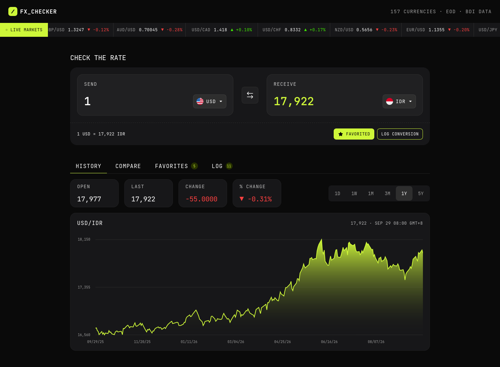
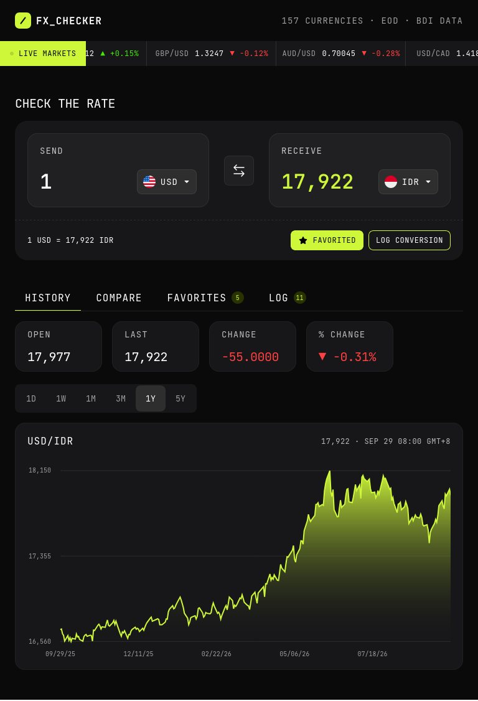
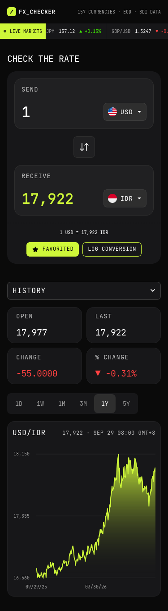

# Frontend Mentor - FX Checker solution

This is a solution to the [FX Checker challenge on Frontend Mentor](https://www.frontendmentor.io/challenges/foreign-exchange-currency-converter). Frontend Mentor challenges help you improve your coding skills by building realistic projects.

## Table of contents

- [Overview](#overview)
  - [The challenge](#the-challenge)
  - [Screenshot](#screenshot)
  - [Links](#links)
- [My process](#my-process)
  - [Built with](#built-with)
  - [What I learned](#what-i-learned)
  - [Continued development](#continued-development)
  - [AI Collaboration](#ai-collaboration)
- [Author](#author)

**Note: Delete this note and update the table of contents based on what sections you keep.**

## Overview

### The challenge

Your users should be able to:

#### Converter

- Enter an amount to send and see it convert in real time as they type
- Pick the "send" and "receive" currencies from a searchable currency picker
- See the live exchange rate for the active pair (for example, `1 USD = 0.8530 EUR`)
- Swap the send and receive currencies with the swap button
- Favorite the active pair, and log a conversion to their history

#### Currency picker

- Search the full list of available currencies by code or name
- See currencies grouped into "Popular" and "Other currencies", each row showing the flag, code, and name
- See a check against the currency that's currently selected

#### Live markets ticker

- See a ticker of currency pairs, each with its current rate and 24-hour change (up or down)

#### Rate history

- View a line and area chart of the active pair's rate over time
- Switch the chart range between 1D, 1W, 1M, 3M, 1Y, and 5Y
- See the open, last, absolute change, and percentage change for the selected range

#### Compare

- See their send amount converted into a range of other currencies at once, each with its reference rate
- Pin or unpin any comparison row to their favorites

#### Favorites

- See their pinned pairs, each with its live rate and 24-hour change
- Load a pinned pair back into the converter by selecting its row
- Unpin a pair they no longer want to track

#### Conversion log

- See a log of conversions they've made, each showing the relative time, the pair, and the send and receive amounts
- Clear the whole log
- Delete an individual entry

#### UI & accessibility

- View the optimal layout for the interface depending on their device's screen size
- See hover and focus states for all interactive elements on the page
- Navigate the entire app using only their keyboard

### Screenshot
||||
|---|---|---|
|Desktop|Tablet|Mobile|

### Links

- Solution URL: [Add solution URL here](https://your-solution-url.com)
- Live Site URL: [Add live site URL here](https://your-live-site-url.com)

## My process

### Built with

- HTML5
- SCSS
- TypeScript
- [Vue.js](https://vuejs.org/) - JS Framework
- [VueUse](https://vueuse.org/) - Vue composition utilities
- [ApexCharts](https://apexcharts.com/) - JS charts
- [Motion](https://motion.dev/) - JS animation library
- [Vue Router](https://router.vuejs.org/)

### What I learned

#### Vue 3 Reactivity: ref vs. reactive
* **Array State Management with ref:** Selected ref as the primary standard for dynamic collections and API payloads. Assigning a fresh array directly via .value = newArray preserves reactivity without breaking component watchers or template bindings.
* **The reactive Reassignment Trap:** Declaring reactive([]) creates a Proxy wrapper around an initial array reference. Reassigning the variable directly (e.g., state.list = newArray) destroys the original Proxy reference, causing DOM bindings to fail. To keep reactivity intact with reactive, elements must be mutated in place using .splice() or .push().
* **Architectural Standard:** Adopted ref across all components and composables handling asynchronous data streams for consistency and predictability.
#### Template Optimization & Syntax Precision
* **Data-Driven Marquee Rendering:** Refactored redundant, hardcoded HTML (e.g., 16 duplicate <li> items in scrolling marquees) into dynamic v-for rendering driven by reactive JavaScript arrays, reducing template bloat and improving code maintainability.
* **Object Syntax Integrity:** Enforced strict JavaScript object literal formatting, ensuring correct key-value colon (:) usage and structural comma separation across data structures.

### Continued development

#### Refactoring to Custom Composables (useMarkets)
* **Logic Decoupling:** Extracting API requests and state management out of UI components (Header.vue, Livemarkets.vue) into a standalone useMarkets.js composable.
* **State Scope Strategy:**
  * **Module-Scoped State (Singleton):** Instantiating ref variables outside the composable function so components share identical state without repeating network requests.
  * **Function-Scoped State:** Declaring state inside the composable function when isolated data streams are required per component lifecycle.
#### Pinia Integration Roadmap
* **Transition to Centralized Store:** Scaling to Pinia (utilizing Setup Stores syntax) for intermediate-level challenge projects to establish global state management.
* **Scalability Benefits:** Integrates out-of-the-box Vue DevTools inspection, time-travel debugging, SSR readiness, and modular store architecture (useMarketStore, useAuthStore) as application complexity grows.

### AI Collaboration

* **IDE Integration:** Built within the OpenCode development environment, leveraging the custom Big Pickle agent.
* **Deep Context Ingestion:** Provided workspace JSON/AST metadata (inspecting App.vue, Header.vue, Livemarkets.vue, and /services) to give the AI complete context over the project's real-time state and file hierarchy.
* **Constraint-Based Mentorship (AGENTS.md):** Configured strict agent guidelines instructing the AI to act as a senior technical mentor. The AI focused on identifying syntax edge cases, explaining reactivity trade-offs, and guiding architectural choices without generating copy-paste code blocks.

## Author

- Frontend Mentor - [@Yahyaball](https://www.frontendmentor.io/profile/Yahyaball)